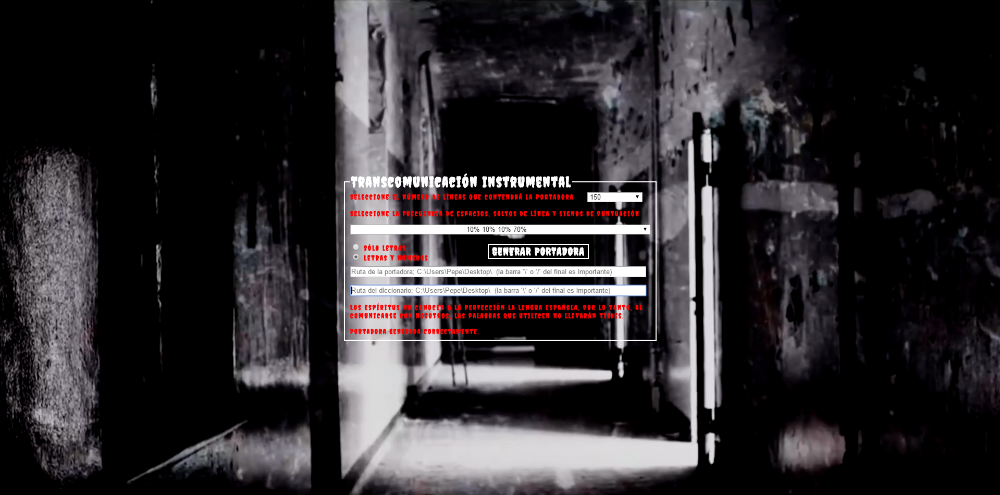

# Transcomunicacion-instrumental
El ejercicio que se propone es la realización de un programa que permita
realizar la TCI mediante la creación y el posterior análisis de ficheros
de texto.
En primer lugar, el programa deberá generar la portadora, que será un fichero
de texto creado con caracteres producidos de forma aleatoria. Se podrán
especificar varios parámetros como el número de líneas o páginas que se
quieren generar, si se incluyen letras únicamente o bien letras y números,
frecuencia aproximada de espacios, saltos de línea y signos de puntuación,
etc. Se obtienen portadoras de calidad - con más probabilidad de contener
mensajes - cuando la proporción de las letras que contienen éstas coincide
con las del idioma español.
Frecuencia de aparición de letras:

[http://es.wikipedia.org/wiki/Frecuencia_de_aparici%C3%B3n_de_letras](http://es.wikipedia.org/wiki/Frecuencia_de_aparici%C3%B3n_de_letras)

Una vez creado el fichero de texto, el programa deberá ser capaz de analizarlo,
al menos de una forma superficial, de modo que nos resulte fácil encontrar los
posibles mensajes. Para realizar este análisis, el programa irá comparando
una a una todas las palabras que aparecen en el texto con las que hay en
el diccionario de español. En caso de coincidencia, la palabra o palabras
encontradas deben aparecer resaltadas con un color diferente al resto del
texto o bien en vídeo inverso. Opcionalmente se pueden mostrar estadísticas
con el número total de palabras encontradas, distancia media entre esas
palabras, palabras reales por cada mil palabras generadas, etc.
El alumno puede encontrar ficheros con las palabras que tiene el idioma
español en formato digital en la siguiente dirección. Se trata de una muestra,
hay otros muchos diccionarios disponibles en internet:

[http://es.wikipedia.org/wiki/Frecuencia_de_aparici%C3%B3n_de_letras](http://lasr.cs.ucla.edu/geoff/ispell-dictionaries.html#Spanish-dicts)

## <a target="_blank" href="https://rawgit.com/AdrianAguilarEscudero7/Transcomunicacion-instrumental/master/Transcomunicacion_instrumental.html">Enlace</a> a una presentación donde se puede ver un vídeo de la aplicación usándose.

## Algunas capturas de la aplicación

### Índice 1

### Índice 2

### Índice 3

